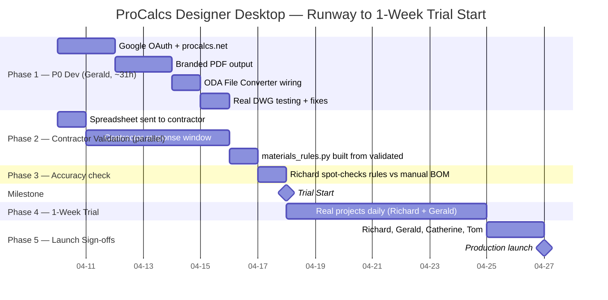

# ProCalcs Designer Desktop — MVP Gap Analysis

> Generated 10-04-2026 per the 4-step Velocity Guide
> Input: `MVP-CHECKLIST.md` + live code audit
> Target milestone: 1-week team trial start

---

## 1. P0 Status Table

Status key: **Completed** = shipping and verified, **Partial** =
working but missing scope, **Missing** = no code yet.

### Auth & Access

| P0 Feature | Status | Code Evidence |
|---|---|---|
| Google OAuth @procalcs.net | Missing | Zero auth code across all three services. Flask app configures CORS only; Express adapter has no auth middleware on any `/api/*` route. |
| Individual accounts (~11 users) | Missing | Gated on OAuth. |

### Core — .rup to BOM Pipeline

| P0 Feature | Status | Code Evidence |
|---|---|---|
| .rup file upload replaces JSON textarea | Completed | SPA dropzone + adapter proxy + Flask `parse-rup` endpoint shipped in Phase C (commits `485df30`, `7bed2c0`). |
| Parser extracts design data from .rup binary | Completed | 570-line canonical parser at `procalcs-bom/backend/utils/rup_parser.py`. 14-test fixture suite green against real Enos sample. |
| Installation materials rules engine (Python, deterministic) | Missing | `materials_rules.py` does not exist. Blocked on contractor spreadsheet validation (not yet sent). |
| Contractor Intelligence Profiles (pricing, brands, markups, overrides) | Completed | Full CRUD + extended fields (brand color, logo, supplier contact/email, markup tiers) in today's backlog pass (commits `c96620e`, `7687749`). 2 profiles seeded. |
| BOM generation applies profile to extracted data | Completed | `bom_service.generate()` flow: AI estimates quantities, Python applies pricing/markup/overrides. Live-verified: 49 line items, $12,144 cost / $15,328 price. |

### PDF-to-CAD Cleanup (launches with BOM)

| P0 Feature | Status | Code Evidence |
|---|---|---|
| DXF upload + entity-type cleanup end-to-end | Completed | `cleaner_routes.py` POST endpoint + `cleaner_service.clean_dxf` function + streaming download by job_id. |
| Smart INSERT Filter | Completed | `insert_filter.py` fully implemented — keeps doors + ventilation, strips furniture/electrical/plumbing, unknown defaults to KEEP (Richard's rule). |
| ODA File Converter wired for DWG→DXF→clean→DXF→DWG | Partial | ODA config path exists but subprocess call is a TODO at `cleaner_service.py:172–185`. DWG upload returns "DWG conversion coming soon". |
| Test with real DWG files from designers | Missing | `test_fixtures/` contains only `.gitkeep`. No real designer DWGs exercised. |
| Output works cleanly in Wrightsoft | Missing | Depends on the DWG roundtrip and real-DWG testing above. |

### BOM Output & Deliverable

| P0 Feature | Status | Code Evidence |
|---|---|---|
| Branded PDF output (the $50–$150 deliverable) | Missing | Zero PDF-generation library in any requirements.txt / package.json. Only current export is CSV + browser `window.print()` (CSS-styled print view). |
| Professional layout (not spreadsheet printout) | Partial | Print view has category grouping and tables, but is not truly branded/templated. |

### Profile Management

| P0 Feature | Status | Code Evidence |
|---|---|---|
| Create/edit/delete contractor profiles | Completed | SPA profile form + adapter + Flask CRUD endpoints. |
| Profile fields complete | Completed | Schema now includes supplier + pricing + markup + markup tiers + brands + part name overrides + branding (as of today's backlog pass). |

### Data & Integrations

| P0 Feature | Status | Code Evidence |
|---|---|---|
| Firestore for contractor profiles | Completed | Live. Two profiles seeded (ProCalcs Direct + Beazer Homes AZ). |
| Cloud SQL Postgres for app data | Partial (stale) | Checklist says "already provisioned" but `procalcs-hvac-pg` was torn down during the mockups retirement. **Open question: is it actually needed for MVP?** App doesn't persist job history (P2), profiles live in Firestore. |
| Claude API for hybrid quantity estimation | Completed | Wired in `bom_service._call_ai_for_quantities`. Hybrid prompt reads `raw_rup_context` when structured arrays are sparse. |

### Infrastructure & Deployment

| P0 Feature | Status | Code Evidence |
|---|---|---|
| Cloud Run deployment | Completed | All three services live. Latest revisions: api 00003-q25, bom 00003-zqv, cleaner healthy. |
| Secret Manager for API keys | Completed | Anthropic key + Flask secret both in Secret Manager, IAM wired. |

### Trust & Polish

| P0 Feature | Status | Code Evidence |
|---|---|---|
| Installation materials rules validated by contractor | Missing | Spreadsheet created per checklist but not yet sent. Critical-path external dependency. |
| 1-week testing period | Missing | Not started. |
| Accuracy spot-check vs manual BOM | Missing | Gated on trial. |

### Launch & Sign-off

| P0 Feature | Status | Code Evidence |
|---|---|---|
| Richard confirms accuracy | Missing | Gated on trial. |
| Gerald confirms tech stability | Missing | Gated on trial. |
| Catherine approves | Missing | Ceremony. |
| Tom final go | Missing | Ceremony. |

**Tally:** 13 Completed, 4 Partial, 10 Missing. Critical path runs
through OAuth, materials rules engine, branded PDF, and DWG
roundtrip.

---

## 2. Burn-down — Hours to Trial Start

### Gerald dev hours (coding work)

| Remaining P0 | Hours | Rationale |
|---|---:|---|
| Google OAuth @procalcs.net | 10 | Express session middleware + OAuth flow + domain allow-list + SPA login page + route protection on all services |
| Branded PDF output | 8 | Pick library (WeasyPrint recommended — Python-side, same container as bom_service), template design, wire Download PDF button, test against real BOM response |
| ODA File Converter wiring | 5 | Install ODA binary in pdf-cleaner Dockerfile, wrap subprocess, replace the stub, error handling for conversion failures |
| Real DWG testing + fixes | 3 | Estimate — Richard sends 3–5 real project DWGs, triage issues found |
| materials_rules.py engine (code only) | 5 | Convert validated spreadsheet rules to Python functions, wire output into the existing BOM formatter. **Gated on contractor validation.** |
| **Total Gerald hours** | **31** | ≈ 5.2 focused days at 6h/day |

### External calendar blockers (not Gerald)

| Blocker | Duration |
|---|---|
| Contractor spreadsheet roundtrip | ~1 week |
| 1-week trial itself | 7 days |
| Sign-off ceremony (Richard → Gerald → Catherine → Tom) | ~2 days |

### Critical-path summary

Dev work and contractor validation run in **parallel**. Critical path is:

```
max(5.2 dev days, 7 spreadsheet days)
+ 7 trial days
+ 2 sign-off days
= ~16 calendar days from kickoff
```

Starting **2026-04-10**, launch target is **approximately 2026-04-26**.

---

## 3. Mermaid Gantt — Runway



---

## 4. Deferred / Zombie Code Audit

The checklist explicitly defers features like Gemini, QuickBooks,
Bland AI, Zoho Cliq, Stripe, PostHog, the validator, job history,
and scanned blueprint AI. Scanning for active code references:

| Deferred Feature | Found Where | Risk to Trial |
|---|---|---|
| Gemini (Google LLM) | `phase1_validator/reference_code/gemini_estimate.py` — imports `google.genai` | **None.** Only imported inside `phase1_validator/`. Zero imports cross that directory boundary. |
| QuickBooks | `phase1_validator/reference_code/api.py` — `import quickbooks_routes` | **None.** Quarantined to phase1_validator. |
| Bland AI | Not found | No risk. |
| Zoho Cliq | Not found | No risk. |
| Stripe / payments | Not found | No risk. |
| PostHog / analytics | Not found | No risk. |
| Validator (whole project) | `phase1_validator/` directory exists | **None.** Grep across all other services returns zero imports from `phase1_validator`. Safely quarantined. |
| Job history / "my previous BOMs" | Not implemented | No risk. |
| Scanned blueprint AI vision | Not implemented | No risk. |

**Verdict: zero zombie-code risk for the 1-week trial.**
`phase1_validator/` is effectively a sandbox. No disable steps needed.
The trial can proceed without any cleanup work on deferred features.

---

## 5. Open Questions — Escalate to Tom

1. **Cloud SQL necessity.** Checklist says "already provisioned" but
   `procalcs-hvac-pg` was deleted in the mockups retirement. Firestore
   handles profiles; job history is P2. Is Cloud SQL actually needed
   for MVP, or can we cross it off the list?

2. **ODA install mechanism.** The DWG converter binary needs to be
   on the pdf-cleaner container. Bake it into the Dockerfile or mount
   as a sidecar? Product decision before Gerald can wire Phase 1c.

3. **Branded PDF template ownership.** Who designs the visual
   template? Tom mocks it up, or does Gerald mirror the existing
   print-view layout and tighten the logo/header?

4. **Validator spreadsheet trigger.** Has the spreadsheet actually
   been sent to a contractor? If not, the external critical path
   hasn't started yet and the runway extends.

5. **Sign-off ceremony.** Synchronous meeting or async thumbs-up in
   Slack? Affects the 2-day sign-off estimate in the Gantt.

---

## Exit Criteria

- [x] Validated P0 Checklist status table (§1)
- [x] Burn-down Estimate (§2) — **31 Gerald hours / ~16 calendar days**
- [x] Mermaid Gantt Chart code block (§3)
- [x] Deferred / Zombie Code audit (§4) — no risk found
- [ ] Tom answers the 5 open questions above
